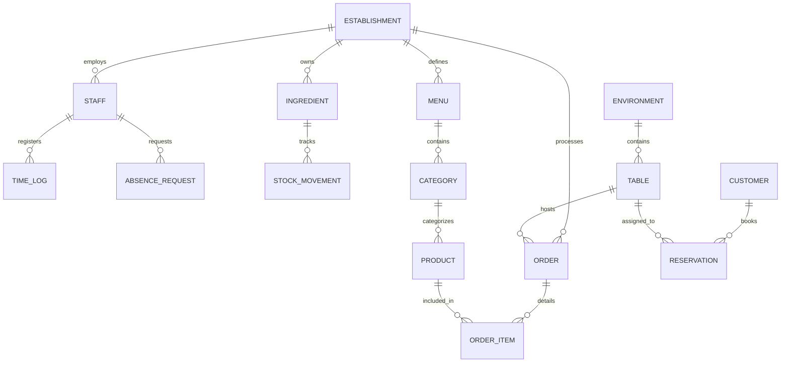

# 🏗️ Arquitectura de Datos Maestro

Esta sección define la **fuente de verdad absoluta** para la persistencia de datos en Camarai. El sistema utiliza **Convex** como motor de base de datos reactiva, operando bajo un modelo **multi-tenant** donde la segregación de datos se garantiza mediante el identificador de cada establecimiento.

---

## 🗺️ Modelo de Entidad-Relación (ER)

El siguiente diagrama ilustra las core-entities y sus vínculos relacionales.

---

## 💎 Estándares Técnicos de Campo

Para garantizar la integridad y precisión financiera, seguimos estas reglas estrictas:
- **Moneda**: Todos los valores monetarios se almacenan como `number` en **céntimos** de Euro (Integer).
- **Tiempo**: Los registros cronológicos utilizan `number` en **Unix Epoch (milisegundos)**.
- **IDs**: Referencias cruzadas utilizando `Id<"table_name">` nativo de Convex.
- **Strings**: Formatos de fecha estandarizados en `ISO 8601` (YYYY-MM-DD) cuando no se requiere precisión de milisegundos.

---

## 🏢 1. Núcleo Organizacional

### Tabla: `establishments`
*Configuración maestra del local y estado de cuenta.*

| Campo | Tipo | Index | Descripción |
| :--- | :--- | :--- | :--- |
| `nombre` | `string` | No | Nombre comercial del negocio. |
| `cif` | `string` | **Yes** | Identificador fiscal (Clave única). |
| `owner_id` | `Id<"users">` | **Yes** | Referencia al dueño legal del SaaS. |
| `plan` | `string` | No | `free` \| `starter` \| `pro` \| `enterprise`. |
| `currency` | `string` | No | ISO Currency code (System Default: "EUR"). |
| `status` | `string` | **Yes** | `active` \| `trial` \| `suspended`. |

---

## 👥 2. Capital Humano (RRHH)

### Tabla: `staff`
*Ficha de empleados y control de acceso.*

| Campo | Tipo | Index | Descripción |
| :--- | :--- | :--- | :--- |
| `establishment_id` | `Id<"establishments">` | **Yes** | Segregación de tenant. |
| `rol` | `string` | **Yes** | `admin` \| `manager` \| `waiter` \| `cook`. |
| `pin` | `string` | No | PIN de 4 dígitos (SIEMPRE cifrado en reposo). |
| `salary` | `number` | No | Sueldo base en céntimos. |

<Tip title="Seguridad">
  El PIN nunca debe exponerse en logs ni respuestas de API en texto plano.
</Tip>

---

## 🥘 3. Gestión de Suministros

### Tabla: `ingredients`
*Almacén técnico de insumos.*

| Campo | Tipo | Index | Descripción |
| :--- | :--- | :--- | :--- |
| `name` | `string` | No | Nombre del insumo (ej: "Lomo de Ternera"). |
| `stock` | `number` | No | Cantidad actual (soporta flotantes para Kg/L). |
| `alert_min` | `number` | No | Umbral crítico para pedido automático. |

---

## 💰 4. Operativa de Ventas

### Tabla: `orders`
*Gestión de comandas y facturación activa.*

| Campo | Tipo | Index | Descripción |
| :--- | :--- | :--- | :--- |
| `table_id` | `Id<"tables">` | **Yes** | Mesa vinculada. |
| `status` | `string` | **Yes** | `open` \| `paid` \| `cancelled` \| `refunded`. |
| `total_amount` | `number` | No | Valor acumulado en céntimos. |
| `created_at` | `number` | **Yes** | Apertura de la comanda (ms). |

---

## 📜 5. Auditoría y Logs de Sistema

### Tabla: `event_log`
*Trazabilidad total de eventos de seguridad y negocio.*

| Campo | Tipo | Index | Descripción |
| :--- | :--- | :--- | :--- |
| `type` | `string` | **Yes** | `security` \| `inventory` \| `operational`. |
| `level` | `string` | No | `info` \| `warning` \| `critical`. |
| `actor` | `string` | No | Usuario o sistema que disparó el evento. |
| `payload` | `object` | No | Datos adicionales en formato JSON. |

---

<Note>
  **Nota de Arquitectura**: Para optimizar el rendimiento de las consultas en Convex, evite el uso masivo de objetos anidados profundamente. Favorezca la normalización mediante tablas hijas para estructuras de datos dinámicas.
</Note>
